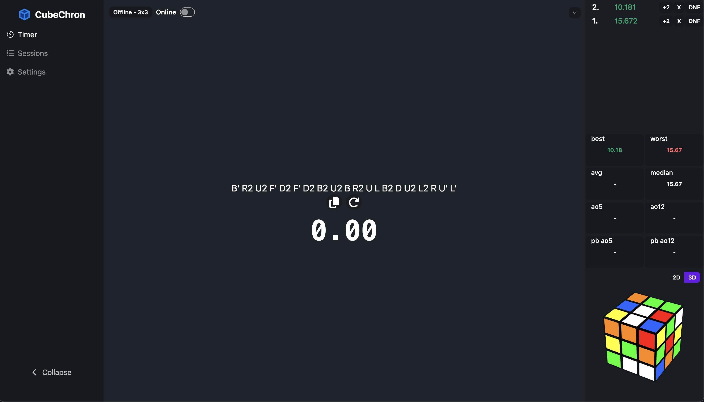

# CubeChron
[CubeChron](https://cube-chron.com) is a [speed-cubing](https://en.wikipedia.org/wiki/Speedcubing) application that allows users to track times and statistics both offline and online.

## Features
- Solve and solve session data is accumulated for statistics
- Customizable appearance: theme, side bar modules, focus mode
- Data persistence can occur online or offline in browser with the switch of a button

## Infrastructure
- Go backend REST API that interfaces with a Postgres DB
- Frontend built with React.js, TypeScript, Tailwind CSS and Daisy UI components.
- IndexedDB for offline storage
